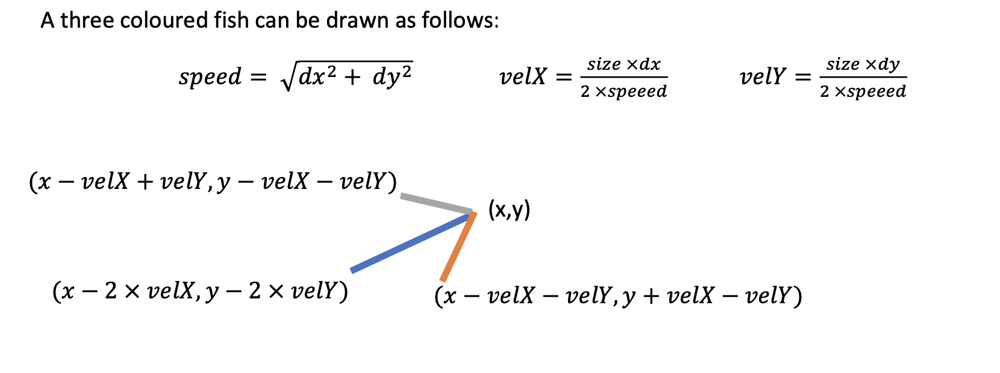

# FishTank

####Problem Description

Part A: Using the UML below create a class that represents a fish swimming in a tank. A Fish runs in a separate thread while it is still alive and has an x,y position. A fish moves within its world from (0,0) to (world_width, world_height) pixel coordinates, increasing its position by suitable dx,dy movement values. It will also periodically generate small randomized noise factors which are added or subtracted to its dx, dy movement values after several movements (but still keeping dx and dy below an upper threshold). A fish is also randomly given a size during instantiation within some min and max value. A fish is instantiated with a reference to a FishShoal collection.

```$xslt
Fish
 - x, y : double
- dx, dy : double
- size : double
- isAlive : boolean
+ world_width, world_height : int - colour : Color[]
- shoal : FishShoal
 
+ Fish(shoal : FishShoal) + run(): void
+ getX(): double
+ getY(): double
+ getSize() : double
+ kill() : void
- move() : void
+ eat(target : Fish) : void + draw(g : Graphics) : void
```


 
.

As a fish moves around the world it should check to see if it can eat another fish by passing itself to the FishShoal method canEat, and obtaining a reference to a target fish available to eat (or null if it cannot eat a fish). The eat method is used to feed this fish with the target parameter fish, in which case it kills the target fish (stopping its thread from running) and increases its size (up to a maximum). If a fish dies it should remove itself from the shoal.
A three coloured fish can be drawn as follows:





####Part B: 
Using the UML diagram below, create a class called FishShoal which represents a shoal of fish by encapsulating a List of Fish objects. It has methods to remove and add fish to the shoal and size to obtain the number of fish in the shoal. It has a method drawShoal which draws all fish in the shoal by calling the draw method of each Fish. The method canEat is used to check if the parameter fish can eat any other fish in the shoal. The two basic rules for the parameter fish to eat another fish in the fish shoal is as follows:
- The parameter fish must be 40% bigger in size than a target fish
- The parameter Fish position must be within range of the target fish position, the range is
determined by taking an average of the size of the two fish.
If the parameter fish can eat a fish in the shoal the canEat method will return reference to that fish
otherwise it will return null if the parameter fish cannot eat.


```$xslt

FishShoal
- fishList : List<Fish>
+ FishShoal()
+ add(fish : Fish) : void
+ remove(fish : Fish) : void
+ drawShoal(g : Graphics) : void + canEat(fish : Fish) : Fish
```


.
####Part C: 
Create a GUI called FishTank, which can be used to draw all Fish in a FishShoal collection. It should have a button which can add a single fish in the shoal and start it running as a thread. Carefully think about what changes need to be made in both FishShoal and Fish to prevent any race conditions from occurring. Feel free to tweak movement variables and fish sizes as necessary to ensure a nice smooth GUI.
Here is a screenshot showing several Fish moving around the world.