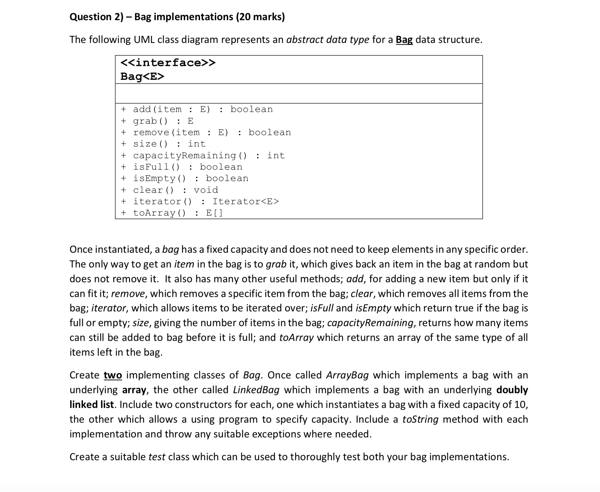
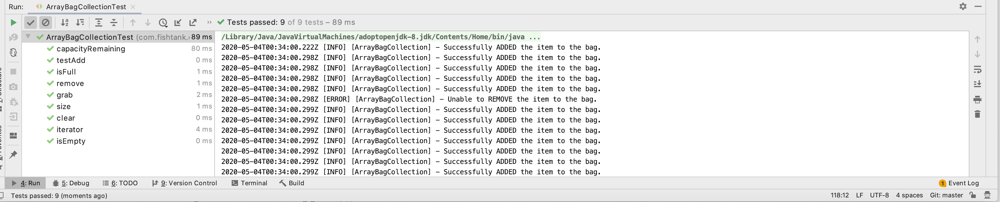

## ArrayBag 

Problem Statement



## Implementation

Included methods outlined in the UML diagram

## Testcase Report

### Output

```java
/Library/Java/JavaVirtualMachines/adoptopenjdk-8.jdk/Contents/Home/bin/java -ea -Didea.test.cyclic.buffer.size=1048576 "-javaagent:/Applications/IntelliJ IDEA.app/Contents/lib/idea_rt.jar=60364:/Applications/IntelliJ IDEA.app/Contents/bin" -Dfile.encoding=UTF-8 -classpath "/Applications/IntelliJ IDEA.app/Contents/lib/idea_rt.jar:/Applications/IntelliJ IDEA.app/Contents/plugins/junit/lib/junit5-rt.jar:/Applications/IntelliJ IDEA.app/Contents/plugins/junit/lib/junit-rt.jar:/Library/Java/JavaVirtualMachines/adoptopenjdk-8.jdk/Contents/Home/jre/lib/charsets.jar:/Library/Java/JavaVirtualMachines/adoptopenjdk-8.jdk/Contents/Home/jre/lib/ext/cldrdata.jar:/Library/Java/JavaVirtualMachines/adoptopenjdk-8.jdk/Contents/Home/jre/lib/ext/dnsns.jar:/Library/Java/JavaVirtualMachines/adoptopenjdk-8.jdk/Contents/Home/jre/lib/ext/jaccess.jar:/Library/Java/JavaVirtualMachines/adoptopenjdk-8.jdk/Contents/Home/jre/lib/ext/localedata.jar:/Library/Java/JavaVirtualMachines/adoptopenjdk-8.jdk/Contents/Home/jre/lib/ext/nashorn.jar:/Library/Java/JavaVirtualMachines/adoptopenjdk-8.jdk/Contents/Home/jre/lib/ext/sunec.jar:/Library/Java/JavaVirtualMachines/adoptopenjdk-8.jdk/Contents/Home/jre/lib/ext/sunjce_provider.jar:/Library/Java/JavaVirtualMachines/adoptopenjdk-8.jdk/Contents/Home/jre/lib/ext/sunpkcs11.jar:/Library/Java/JavaVirtualMachines/adoptopenjdk-8.jdk/Contents/Home/jre/lib/ext/zipfs.jar:/Library/Java/JavaVirtualMachines/adoptopenjdk-8.jdk/Contents/Home/jre/lib/jce.jar:/Library/Java/JavaVirtualMachines/adoptopenjdk-8.jdk/Contents/Home/jre/lib/jsse.jar:/Library/Java/JavaVirtualMachines/adoptopenjdk-8.jdk/Contents/Home/jre/lib/management-agent.jar:/Library/Java/JavaVirtualMachines/adoptopenjdk-8.jdk/Contents/Home/jre/lib/resources.jar:/Library/Java/JavaVirtualMachines/adoptopenjdk-8.jdk/Contents/Home/jre/lib/rt.jar:/Library/Java/JavaVirtualMachines/adoptopenjdk-8.jdk/Contents/Home/lib/dt.jar:/Library/Java/JavaVirtualMachines/adoptopenjdk-8.jdk/Contents/Home/lib/jconsole.jar:/Library/Java/JavaVirtualMachines/adoptopenjdk-8.jdk/Contents/Home/lib/sa-jdi.jar:/Library/Java/JavaVirtualMachines/adoptopenjdk-8.jdk/Contents/Home/lib/tools.jar:/Users/rv037030/IdeaProjects/FishTank/target/test-classes:/Users/rv037030/IdeaProjects/FishTank/target/classes:/Users/rv037030/.m2/repository/junit/junit/4.12/junit-4.12.jar:/Users/rv037030/.m2/repository/org/hamcrest/hamcrest-core/1.3/hamcrest-core-1.3.jar" com.intellij.rt.junit.JUnitStarter -ideVersion5 -junit4 com.fishtank.collection.ArrayBagCollectionTest
2020-05-04T00:34:00.222Z [INFO] [ArrayBagCollection] - Successfully ADDED the item to the bag.
2020-05-04T00:34:00.298Z [INFO] [ArrayBagCollection] - Successfully ADDED the item to the bag.
2020-05-04T00:34:00.298Z [INFO] [ArrayBagCollection] - Successfully ADDED the item to the bag.
2020-05-04T00:34:00.298Z [INFO] [ArrayBagCollection] - Successfully ADDED the item to the bag.
2020-05-04T00:34:00.298Z [INFO] [ArrayBagCollection] - Successfully ADDED the item to the bag.
2020-05-04T00:34:00.298Z [ERROR] [ArrayBagCollection] - Unable to REMOVE the item to the bag.
2020-05-04T00:34:00.299Z [INFO] [ArrayBagCollection] - Successfully ADDED the item to the bag.
2020-05-04T00:34:00.299Z [INFO] [ArrayBagCollection] - Successfully ADDED the item to the bag.
2020-05-04T00:34:00.299Z [INFO] [ArrayBagCollection] - Successfully ADDED the item to the bag.
2020-05-04T00:34:00.299Z [INFO] [ArrayBagCollection] - Successfully ADDED the item to the bag.
2020-05-04T00:34:00.299Z [INFO] [ArrayBagCollection] - Successfully ADDED the item to the bag.
2020-05-04T00:34:00.299Z [INFO] [ArrayBagCollection] - Successfully ADDED the item to the bag.
2020-05-04T00:34:00.299Z [INFO] [ArrayBagCollection] - Successfully ADDED the item to the bag.
2020-05-04T00:34:00.299Z [INFO] [ArrayBagCollection] - Successfully ADDED the item to the bag.
2020-05-04T00:34:00.299Z [INFO] [ArrayBagCollection] - Successfully ADDED the item to the bag.
2020-05-04T00:34:00.299Z [INFO] [ArrayBagCollection] - Successfully ADDED the item to the bag.
2020-05-04T00:34:00.299Z [INFO] [ArrayBagCollection] - Successfully ADDED the item to the bag.
2020-05-04T00:34:00.299Z [INFO] [ArrayBagCollection] - Successfully ADDED the item to the bag.
2020-05-04T00:34:00.299Z [INFO] [ArrayBagCollection] - Successfully ADDED the item to the bag.
2020-05-04T00:34:00.299Z [INFO] [ArrayBagCollection] - Successfully ADDED the item to the bag.
2020-05-04T00:34:00.300Z [INFO] [ArrayBagCollection] - Successfully ADDED the item to the bag.
2020-05-04T00:34:00.301Z [INFO] [ArrayBagCollection] - Successfully ADDED the item to the bag.
2020-05-04T00:34:00.301Z [INFO] [ArrayBagCollection] - Successfully ADDED the item to the bag.
2020-05-04T00:34:00.302Z [INFO] [ArrayBagCollection] - Successfully ADDED the item to the bag.
2020-05-04T00:34:00.302Z [INFO] [ArrayBagCollection] - Successfully ADDED the item to the bag.
2020-05-04T00:34:00.302Z [INFO] [ArrayBagCollection] - Successfully ADDED the item to the bag.
2020-05-04T00:34:00.303Z [INFO] [ArrayBagCollection] - Successfully ADDED the item to the bag.
2020-05-04T00:34:00.303Z [INFO] [ArrayBagCollection] - Successfully ADDED the item to the bag.
2020-05-04T00:34:00.303Z [INFO] [ArrayBagCollection] - Successfully ADDED the item to the bag.
2020-05-04T00:34:00.303Z [INFO] [ArrayBagCollection] - Successfully ADDED the item to the bag.
2020-05-04T00:34:00.304Z [INFO] [ArrayBagCollection] - Successfully ADDED the item to the bag.
1
2020-05-04T00:34:00.307Z [INFO] [ArrayBagCollection] - Successfully ADDED the item to the bag.
2020-05-04T00:34:00.307Z [INFO] [ArrayBagCollection] - Successfully ADDED the item to the bag.
2020-05-04T00:34:00.307Z [INFO] [ArrayBagCollection] - Successfully ADDED the item to the bag.
2020-05-04T00:34:00.307Z [INFO] [ArrayBagCollection] - Successfully ADDED the item to the bag.
2020-05-04T00:34:00.308Z [INFO] [ArrayBagCollection] - Successfully ADDED the item to the bag.
2020-05-04T00:34:00.308Z [INFO] [ArrayBagCollection] - Successfully ADDED the item to the bag.
2020-05-04T00:34:00.309Z [INFO] [ArrayBagCollection] - Successfully ADDED the item to the bag.
2020-05-04T00:34:00.309Z [INFO] [ArrayBagCollection] - Successfully ADDED the item to the bag.
2020-05-04T00:34:00.309Z [INFO] [ArrayBagCollection] - Successfully ADDED the item to the bag.
2020-05-04T00:34:00.309Z [INFO] [ArrayBagCollection] - Successfully ADDED the item to the bag.
2020-05-04T00:34:00.309Z [INFO] [ArrayBagCollection] - Successfully ADDED the item to the bag.
2020-05-04T00:34:00.310Z [INFO] [ArrayBagCollection] - Successfully ADDED the item to the bag.
2020-05-04T00:34:00.311Z [INFO] [ArrayBagCollection] - Successfully ADDED the item to the bag.
2020-05-04T00:34:00.311Z [INFO] [ArrayBagCollection] - Successfully ADDED the item to the bag.
2020-05-04T00:34:00.311Z [INFO] [ArrayBagCollection] - Successfully ADDED the item to the bag.
2020-05-04T00:34:00.311Z [INFO] [ArrayBagCollection] - Successfully ADDED the item to the bag.
2020-05-04T00:34:00.315Z [INFO] [ArrayBagCollection] - Successfully ADDED the item to the bag.
2020-05-04T00:34:00.315Z [INFO] [ArrayBagCollection] - Successfully ADDED the item to the bag.
2020-05-04T00:34:00.315Z [INFO] [ArrayBagCollection] - Successfully ADDED the item to the bag.
2020-05-04T00:34:00.315Z [INFO] [ArrayBagCollection] - Successfully ADDED the item to the bag.
2020-05-04T00:34:00.315Z [INFO] [ArrayBagCollection] - Successfully ADDED the item to the bag.

Process finished with exit code 0

```


### Report




### List of Testcases
- ArrayBagCollectionTest.capacityRemaining
- ArrayBagCollectionTest.testAdd
- ArrayBagCollectionTest.isFull
- ArrayBagCollectionTest.remove
- ArrayBagCollectionTest.grab
- ArrayBagCollectionTest.size
- ArrayBagCollectionTest.clear
- ArrayBagCollectionTest.iterator
- ArrayBagCollectionTest.isEmpty